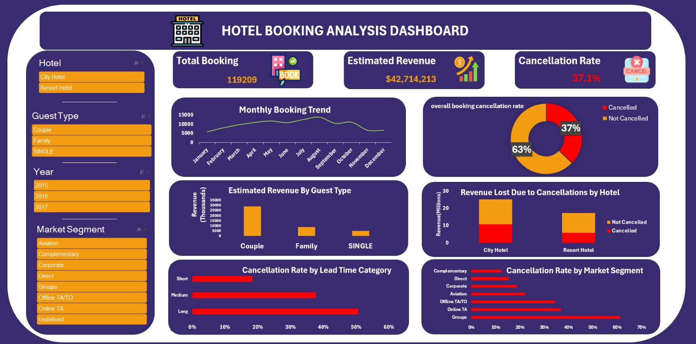

# 🏨 Hotel Booking Analysis Dashboard (Microsoft Excel)

## 📌 Project Overview

This project presents an end-to-end Hotel Booking Analysis using Microsoft Excel.

The project covers the complete data analysis workflow, including:

- Data Cleaning & Validation
- Creating Calculated Columns
- Exploratory Data Analysis (EDA)
- Business Analysis using Pivot Tables
- Interactive Dashboard Design
- Business Insights & Recommendations

The dashboard enables users to explore booking trends, cancellation behavior, customer segments, and estimated revenue through interactive slicers and visualizations.

---

## 🛠️ Tools Used

- Microsoft Excel
- Pivot Tables
- Pivot Charts
- Excel Formulas
- Slicers
- Conditional Formatting

---

## 📊 Dashboard Preview

 

---

## 📈 Business Questions Answered

1. What is the overall booking cancellation rate?
2. Which hotel receives the highest number of bookings?
3. Which hotel has the highest cancellation rate?
4. Which market segment generates the highest number of bookings?
5. Which market segment has the highest cancellation rate?
6. How do hotel bookings vary across different months?
7. Which guest type generates the highest estimated revenue?
8. How does lead time affect the cancellation rate?
9. Which season generates the highest estimated revenue?
10. Which hotel generates the highest estimated revenue, and how much revenue is potentially lost due to cancellations?

---

## 💡 Key Insights

- City Hotel generated the highest estimated revenue.
- Summer produced the highest estimated revenue.
- Long lead-time bookings showed the highest cancellation rate.
- Groups recorded the highest cancellation rate among market segments.
- City Hotel experienced the largest potential revenue loss due to cancellations.

---

## 📁 Project Files

- Hotel_Booking_Analysis_Dashboard.xlsx → Complete Excel Project
- README.md → Project Documentation

---

## 👨‍💻 Author

**Abdelrahmen Zidan**

Data Analyst | Microsoft Excel | SQL | Power BI (Learning)
